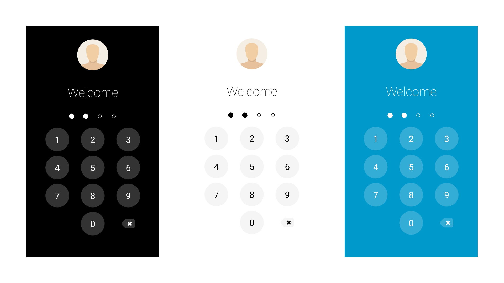

# PinLockView
A clean, minimalistic, easy-to-use and highly customizable pin lock custom view for Android.


This library allows you to implement a pin lock mechanism in your app **easily and quickly**. There are **plenty of customization options** available to change the look-and-feel of this view to match your app's theme.

You can also use it as a dial pad to dial numbers. There are several other use cases of this library and is not restricted to only pin locking.



## Usage

### Gradle
Top level build file:
``` gradle
allprojects {
    repositories {
        mavenCentral()
    	maven { url 'https://www.jitpack.io' }
    }
}
```
In your application build file:
``` gradle
implementation 'com.msinghal34.pinlockview:pinlockview:3.0.0'
```

### XML

Place the view in your XML layout file.

```xml
<com.msinghal34.pinlockview.PinLockView
    android:id="@+id/pin_lock_view"
    android:layout_width="wrap_content"
    android:layout_height="wrap_content" />
```

### Java
Reference the view in code and add a listener to it.

```java
mPinLockView = (PinLockView) findViewById(R.id.pin_lock_view);
mPinLockView.setPinLockListener(mPinLockListener);
private PinLockListener mPinLockListener = new PinLockListener() {
    @Override
    public Boolean onComplete(String pin) {
        Log.d(TAG, "Pin complete: " + pin);
        return true;
    }

    @Override
    public void onEmpty() {
        Log.d(TAG, "Pin empty");
    }

    @Override
    public void onPinChange(int pinLength, String intermediatePin) {
        Log.d(TAG, "Pin changed, new length " + pinLength + " with intermediate pin " + intermediatePin);
    }
};
```

### Kotlin
Reference the view in code and add a listener to it.

```java
val mPinLockView = findViewById<PinLockView>(R.id.pin_lock_view)
mPinLockView.setPinLockListener(object : PinLockListener {
    override fun onComplete(pin: String?): Boolean {
        Timber.i("Pin entered: $pin")
        return true
    }

    override fun onEmpty() {
        Timber.i("Pin empty")
    }

    override fun onPinChange(pinLength: Int, intermediatePin: String?) {
        Timber.i("Pin changed, new length: $pinLength with intermediate pin: $intermediatePin")
    }
})
```

And that's it! Your PinLockView is ready to rock.

But the good thing is that the ```PinLockView``` comes with a whole lot of customization options which you can use to customize the view in any way you want.

# Customization

## IndicatorDots (Addon)
PinLockView comes bundled with an addon view, ```IndicatorDots``` which can be optionally attached with the PinLockView to indicate pin changes visually to the user.

This **view has been decoupled from the PinLockView** so that you can optionally add it, if necessary. Suppose you are implementing a dial pad, then you will certainly not need this IndicatorView.

Add the view to you XML layout, generally placed above your PinLockView,

### XML
```xml
 <com.msinghal34.pinlockview.IndicatorDots
        android:id="@+id/indicator_dots"
        android:layout_width="wrap_content"
        android:layout_height="wrap_content" />
```
then find a reference to the view and attach it to the parent PinLockView,

### Java
```java
mIndicatorDots = (IndicatorDots) findViewById(R.id.indicator_dots);
mPinLockView.attachIndicatorDots(mIndicatorDots);
```


### Kotlin
```java
val mIndicatorDots = findViewById<IndicatorDots>(R.id.indicator_dots)
mPinLockView.attachIndicatorDots(mIndicatorDots);
```

You **MUST** attach it to the PinLockView, otherwise it will be simply ignored.

## Theming

There are several theming options available through XML attributes which you can use to completely change the look-and-feel of this view to match the theme of your app. The values shown in example are the default ones.

**Customization for PinLock view**
```xml
  app:plv_pinLength="4"                                       // Length of the pin
  app:plv_textColor="#FFFFFF"                                 // Color of the digits and the delete drawable
  app:plv_textSize="24sp"                                     // Font size of digits in the keypad
  app:plv_buttonSize="64dp"                                   // Size of individual keys/buttons
  app:plv_buttonBackgroundColor="#FFFFFF"                     // Keypad buttons' background color. Alpha of 0.2 is applied to color internally
  app:plv_verticalSpacing="12dp"                              // Vertical space between the keypad buttons
  app:plv_horizontalSpacing="32dp"                            // Horizontal space between the keypad buttons
  app:plv_vibrate="true"                                      // Whether to vibrate on key press and success/error events
  app:plv_showDeleteButton="true"                             // Whether to show the delete button or not
  app:plv_deleteButtonDrawable="@drawable/ic_delete"          // Customize drawable for the delete button
  app:plv_deleteButtonSize="48dp"                             // Size of the delete button drawable in the keypad
  app:plv_showButtonPressAnimation="true"                     // Whether to show animation on pressing keypad button or not
```


**Customization for Indicator Dots**
```xml
  app:id_emptyDotDrawable="@drawable/dot_empty"                // Customize the empty dot drawable
  app:id_filledDotDrawable="@drawable/dot_filled"              // Customize the filled dot drawable
  app:id_dotDiameter="14dp"                                    // Diameter of the dots
  app:id_dotMargin="12dp"                                      // Margin between dots
  app:id_dotColor="#FFFFFF"                                    // Color of filled and empty dots, only applicable if custom drawables for dots are not provided
  app:id_indicatorType="fixed"                                 // Available options: "fixed", "fill" and "fillWithAnimation"
```

# Contribution

This library is quite exhaustive and offers a lot of customization options. If you find a bug or would like to improve any aspect of it, feel free to contribute with pull requests.

# License

```
Licensed under the Apache License, Version 2.0 (the "License");
you may not use this file except in compliance with the License.
You may obtain a copy of the License at   

http://www.apache.org/licenses/LICENSE-2.0

Unless required by applicable law or agreed to in writing, software
distributed under the License is distributed on an "AS IS" BASIS,
WITHOUT WARRANTIES OR CONDITIONS OF ANY KIND, either express or implied.
See the License for the specific language governing permissions and
limitations under the License.
```
